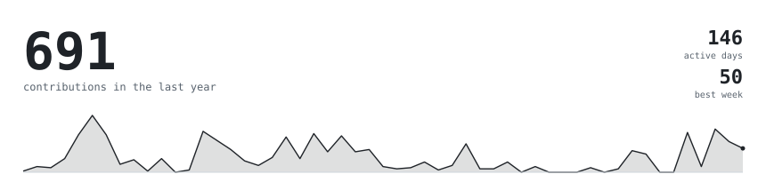
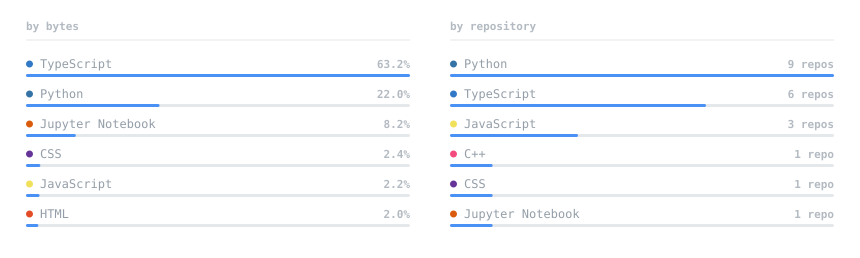
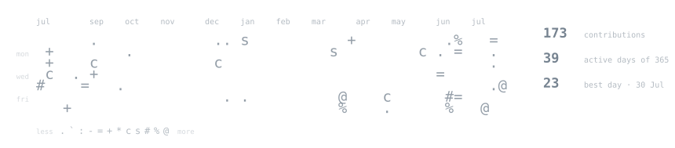

<!--
  Hand-written. The SVGs it references are generated:

    scripts/generate_portrait.py   portrait.svg      (local, needs a photo)
    scripts/build_headings.py      heading-*.svg     (local, on demand)
    scripts/generate_stats.py      stats/streak/langs/year.svg  (nightly, CI)

  Everything GitHub's sanitiser strips has been avoided: no <style>, no style
  or class attributes, no inline <svg>, no . Test any change against
  POST /markdown before committing -- it applies the same sanitiser as the
  site, so it tells you what will actually survive.

  Prose is hard-wrapped with   at about 76 characters. Full-width
  paragraphs run to ~110 characters on a desktop, which is a bad measure to
  read. The alternative, a width attribute on a <td>, draws a visible border.
-->

  

<!--
  The links live here in markdown, not inside the SVG above. An <a> inside an
  SVG that is loaded through an  tag is inert -- it renders, but nothing
  is clickable, because an image document does not get to navigate.
-->

  <a href="https://abubakar-yasir-portfolio.vercel.app/">abubakar-yasir.vercel.app</a>
  &nbsp;·&nbsp;
  <a href="https://www.instagram.com/abubakar._.rao/">instagram</a>
  &nbsp;·&nbsp;
  <a href="https://www.linkedin.com/in/abubakar-yasir-web-dev/">linkedin</a>
  &nbsp;·&nbsp;
  <a href="mailto:abubakarrao999@gmail.com">email</a>

> AI engineer and full-stack developer. 
> Automation, multi-agent systems, and workflows that run themselves.

I build the part that sits between a language model and a system that has 
to keep working: retrieval pipelines, agent orchestration, MCP servers, 
Slack integrations, and the ordinary web work that carries them.

[**neuroMedica**](https://github.com/Abu-BakarYasir/neuroMedica) &nbsp;·&nbsp; <samp>typescript</samp> 
A medical imaging assistant.

[**job-apply-agent**](https://github.com/Abu-BakarYasir/job-apply-agent) &nbsp;·&nbsp; <samp>python</samp> 
Applies to jobs automatically.

[**auction_system**](https://github.com/Abu-BakarYasir/auction_system) &nbsp;·&nbsp; <samp>c++</samp> 
Console auction system: registration, bidding, and item availability tracked 
against due dates, persisted to text files.

[**my_slack_mcp**](https://github.com/Abu-BakarYasir/my_slack_mcp) &nbsp;·&nbsp; <samp>python</samp>

[**Rag_App**](https://github.com/Abu-BakarYasir/Rag_App) &nbsp;·&nbsp; <samp>python</samp>

