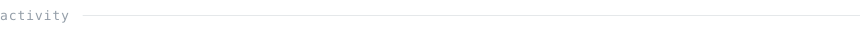

<!--
  This file is hand-written. The SVGs it references are generated:

    scripts/generate_portrait.py   portrait.svg      (local, needs a photo)
    scripts/build_headings.py      heading-*.svg     (local, on demand)
    scripts/generate_stats.py      stats/streak/langs/year.svg  (nightly, CI)

  Everything GitHub's sanitiser strips has been avoided: no <style>, no style
  or class attributes, no inline <svg>, no . Test any change against
  POST /markdown before committing -- it applies the same sanitiser as the
  site, so it tells you what will actually survive.
-->

> AI engineer and full-stack developer. I work where a language model meets
> something that has to keep running.

Most of what I build sits between a model and a system that has to behave: 
retrieval pipelines, multi-agent setups, MCP servers, Slack integrations, 
and the ordinary web work that carries them.

<samp>Python</samp> · <samp>TypeScript</samp> · <samp>JavaScript</samp> · <samp>C++</samp>

<!-- PORTRAIT GOES HERE once scripts/generate_portrait.py has been run:
       

     and restore the sentence about it in the paragraph below. -->

**This page draws itself.** Every figure below comes from a scheduled 
action that queries the GraphQL API and commits the SVGs it draws, in 
this repository, with the standard library and nothing else. There are 
no third-party requests on this page — no stats cards, no streak 
services, nothing that can rate-limit or go dark.

<samp>languages</samp> &nbsp;&nbsp; Python · TypeScript · JavaScript · C++ · CSS

<samp>ai / ml</samp> &nbsp;&nbsp;&nbsp;&nbsp;&nbsp; retrieval-augmented generation · agent orchestration · CNNs

<samp>platforms</samp> &nbsp;&nbsp; MCP servers · Slack apps · Vite · Jupyter

<samp>TypeScript</samp> &nbsp; **[neuroMedica](https://github.com/Abu-BakarYasir/neuroMedica)**

<samp>TypeScript</samp> &nbsp; **[abubakar-yasir-portfolio](https://github.com/Abu-BakarYasir/abubakar-yasir-portfolio)**

<samp>Python</samp> &nbsp;&nbsp;&nbsp;&nbsp;&nbsp; **[job-apply-agent](https://github.com/Abu-BakarYasir/job-apply-agent)**

<samp>Python</samp> &nbsp;&nbsp;&nbsp;&nbsp;&nbsp; **[my_slack_mcp](https://github.com/Abu-BakarYasir/my_slack_mcp)**

<samp>Python</samp> &nbsp;&nbsp;&nbsp;&nbsp;&nbsp; **[Rag_App](https://github.com/Abu-BakarYasir/Rag_App)**

<samp>github</samp> &nbsp;&nbsp; [@Abu-BakarYasir](https://github.com/Abu-BakarYasir)

---

Portrait pipeline adapted from the ASCII Portrait README Guide.
Typeface <a href="https://www.jetbrains.com/lp/mono/">JetBrains Mono</a>,
subset and inlined, <a href="assets/fonts/OFL.txt">SIL OFL 1.1</a>.
Stats refreshed nightly by <a href=".github/workflows/refresh-stats.yml">a
scheduled action</a>; all the code is in <a href="scripts">scripts/</a>.

